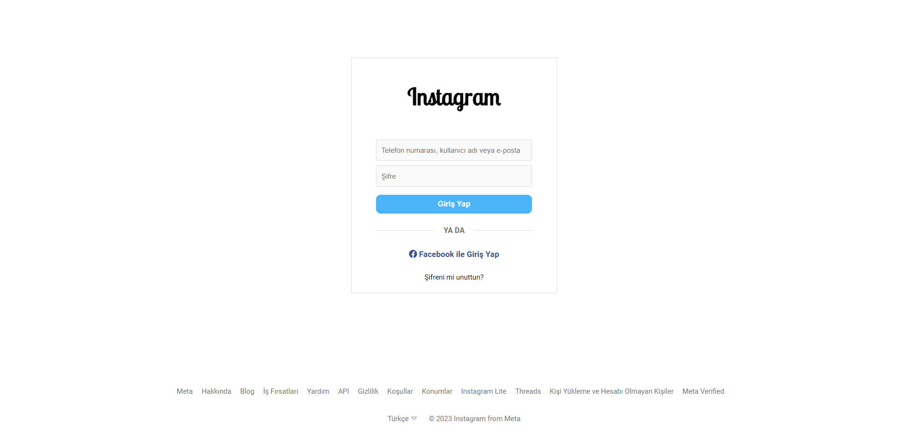
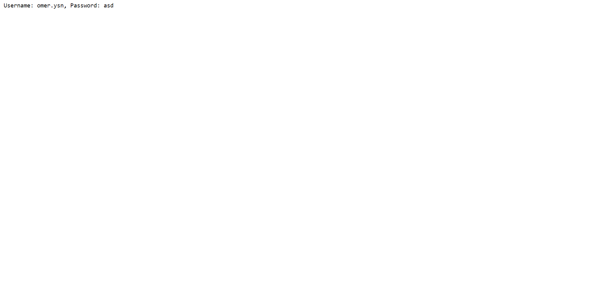

<h1>Instagram Script</h1>

!!! THIS PROJECT ONLY FOR EDUCATION !!!

<h2>Languages ​​of the Software Used</h2>

- HTML

- CSS

- Node JS

<h2>What is our purpose?</h2>

Nowadays, the security of our personal accounts depends on people's awareness.

That's why in this project we showed how easy it is for personal accounts to be compromised by hackers.

<h2>So, how can we protect ourselves from this?</h2>

First, make sure that the social network links you are logged into are correct.

Secondly, don't trust anyone. Nowadays, anyone can write these codes and therefore you must be conscious.

It's that simple.

<h2>Fallow Us</h2>

<h2>Instagram : omer.ysn</h2>

<h2>index.html</h2>

<h2>logs.txt</h2>

